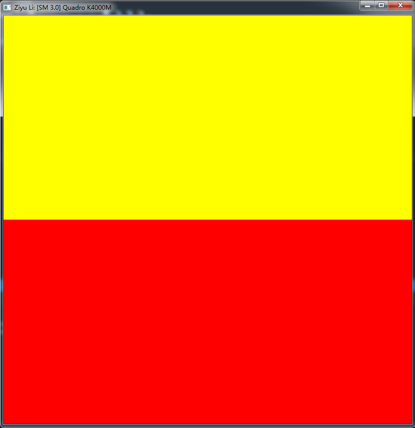
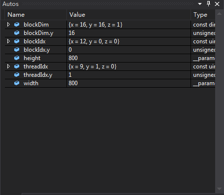
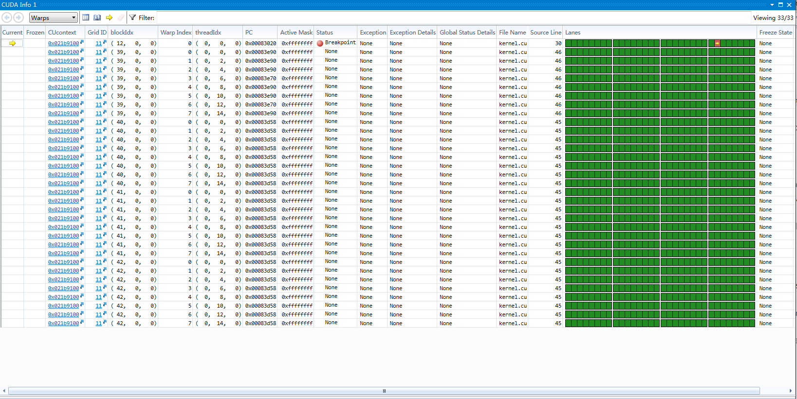

Project 0 CUDA Getting Started
====================

**University of Pennsylvania, CIS 565: GPU Programming and Architecture, Project 0**

* Ziyu Li
* Tested on: (TODO) Windows 7, i7-3840QM @ 2.8GHz 16GB, Nvidia Quadro K4000M 4096MB (Personal Laptop)

### Result

+ 

+ 

+ 

+ 

